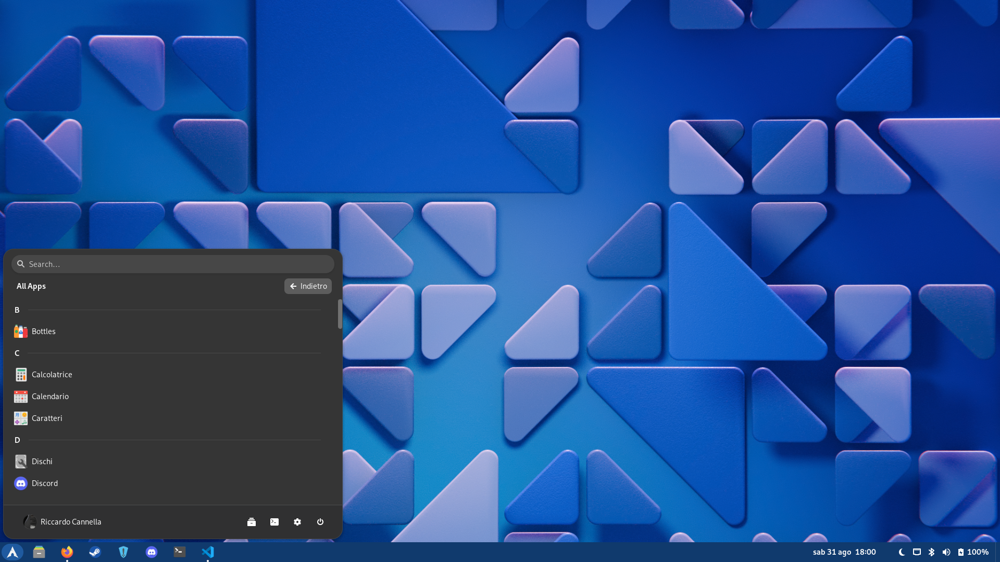
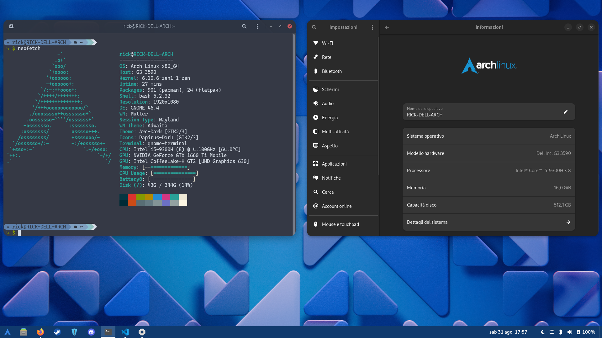

# GNOME DE Installation

This guide will walk you through the installation of the [GNOME Desktop Environment](https://www.gnome.org/).
I will also specify my own list of installed packages, because I don't want to install
things that I'm not going to use.

<!-- TOC -->
- [Step 0: Prerequisites](#step-0-prerequisites)
- [Step 1: Packages](#step-1-packages)
- [Step 2: Configuration](#step-2-configuration)
- [Screenshots](#screenshots)
<!-- /TOC -->

## Step 0: Prerequisites

If you haven't already, install [YaY](https://github.com/Jguer/yay?tab=readme-ov-file#binary)
so you can easily install AUR packages.

Also, clone this repository if you want to install my own set of packages.

> [!WARNING]
>
> As already stated in the preface, do not blindly install these packages.
> Review the lists and ask yoursef if you know what they do and if you
> actually need them. This is my own list for my own laptop for my own purposes.

## Step 1: Packages

Arch provides two package groups: [`gnome`](https://archlinux.org/groups/x86_64/gnome/)
and [`gnome-extra`](https://archlinux.org/groups/x86_64/gnome-extra/).

The most basic GNOME installation without using those meta-packages would be:

```bash
sudo pacman -S gdm gnome-session gnome-shell
```

However, that would be pretty much useless as it does not include *anything*
besides the basic desktop functionality (e.g.: it's missing a file explorer).
[My list of packages](../../packages/gnome/) adds most of the basics, without
cluttering the system with software I would not use (like `evince`).

```bash
sudo pacman -S $(cat packages/gnome/pacman.list)
yay -S $(cat packages/gnome/aur.list)
```

## Step 2: Configuration

It would be too long to explain everything I did, so I also have my
[`dconf` settings](conf/dconf_dump) in this repository. To apply them run:

```bash
dconf load -f / < 2.Gnome_DE/conf/dconf_dump
```

> [!TIP]
> If you want to dump your own configuration for later use, you can run:
>
> ```bash
> dconf dump / > dconf_dump
> ```

Also, I think that in my case the [`geoclue` service](https://gitlab.freedesktop.org/geoclue/geoclue),
which is automatically installed as part of the packages in my selection,
is useless. To disable it:

```bash
sudo systemctl stop geoclue
sudo systemctl mask geoclue # for some reason it can't be disabled
```

## Screenshots

The final result will resemble the following screenshots.
YES, I KNOW, it's 🤏 *a bit* 🤏 Windows-like. I specifically
wanted to have this kind of appereance because I'm used to it and I'm more productive
than with GNOME's defaults.






[Go back to index](../#guides)

[Next: Hybrid GPU Configuration](../3.Hybrid_GPU_Configuration/)
