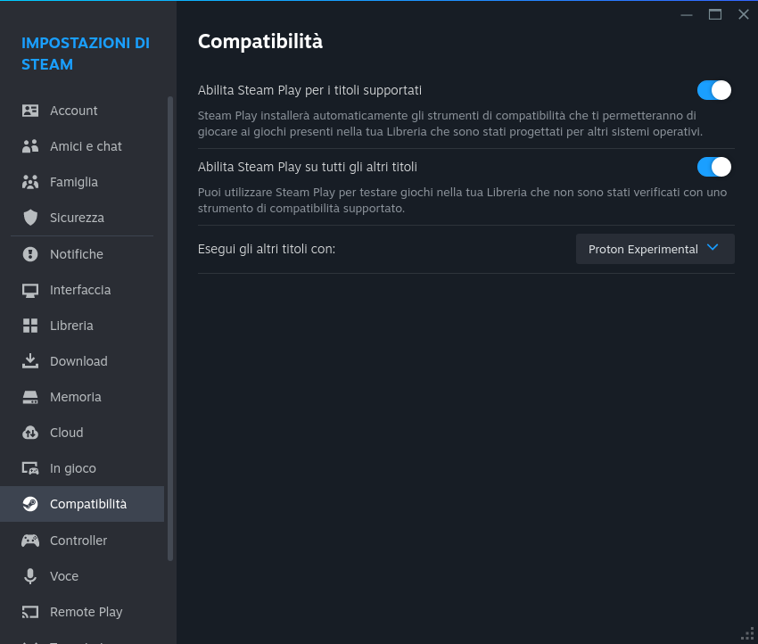

# Gaming

The main task of this whole journey is to enable gaming on my laptop, in a way
that is enjoyable and hassle-free.

This guide will show how to launch games from Steam, GOG and Epic Games libraries.

## 1. Packages

### 1.1. Launchers

To install the launchers, run:

```bash
pacman -S steam gamemode
yay heroic-games-launcher-bin heroic-games-launcher-bin-wayland-hook
```

I chose [Heroic Games Launcher](https://github.com/Heroic-Games-Launcher/HeroicGamesLauncher)
for its simplicity, nice UI and both GOG and Epic Games compatibility.

The `gamemode` package will make sure that the system will not suspend
during gaming sessions. There is also a GNOME shell extension to show the Gamemode
status in the traybar, but unfortunately it's not in the AUR repos (yet?).
To install it, open Extension Manager, go to the "Browse" tab, type "gamemode"
and install the "GameMode Shell Extension".

To also enable a smoother experience, you may also want to install the following
additional packages:

```bash
sudo pacman -S mono wine winetricks
yay protontricks ttf-ms-win11-auto
sudo pacman -S --needed --asdeps giflib lib32-giflib gnutls lib32-gnutls
  v4l-utils lib32-v4l-utils libpulse lib32-libpulse alsa-plugins \
  lib32-alsa-plugins alsa-lib lib32-alsa-lib sqlite lib32-sqlite libxcomposite \
  lib32-libxcomposite ocl-icd lib32-ocl-icd libva lib32-libva gtk3 lib32-gtk3 \
  gst-plugins-base-libs lib32-gst-plugins-base-libs vulkan-icd-loader\
  lib32-vulkan-icd-loader sdl2 lib32-sdl2
```

See [Lutris' list of Wine dependencies](https://github.com/lutris/docs/blob/master/WineDependencies.md#archendeavourosmanjaroother-arch-derivatives).

## 2. Configuring Launchers

### 2.1. Steam

Open Steam and login, go to Settings -> Compatibility and:

- Check "Enable SteamPlay for supported titles"
- Check "Enable SteamPlay for all other titles"
- Select "Proton Experimental" in the "Run other titles with:" dropdown



The Steam launcher will begin to download the Proton runtime. [Proton](https://github.com/ValveSoftware/Proton)
is a fork of Wine maintained by Valve, designed specifically for Steam on Linux.

If you already have a folder with installed Steam games, you can make Steam use that:
go to Settings -> Storage -> Click on the "Local Drive (/)" dropdown, click on
"Add drive" and select your existing Steam folder.

### 2.2. Heroic Games Launcher

Open Heroic and login to both Epic Games and GOG. Go to Wine Manager in the sidebar
and download `Wine-GE-Latest`.

If you have a folder with installed Epic games, you can use them. Go to Library,
find your game and click on its image, click the "Install" button and select the
folder where it's already installed, then continue as if you need to download it.
Heroic will find that there is data in the folder, and after a quick check
the game will be available to run.
