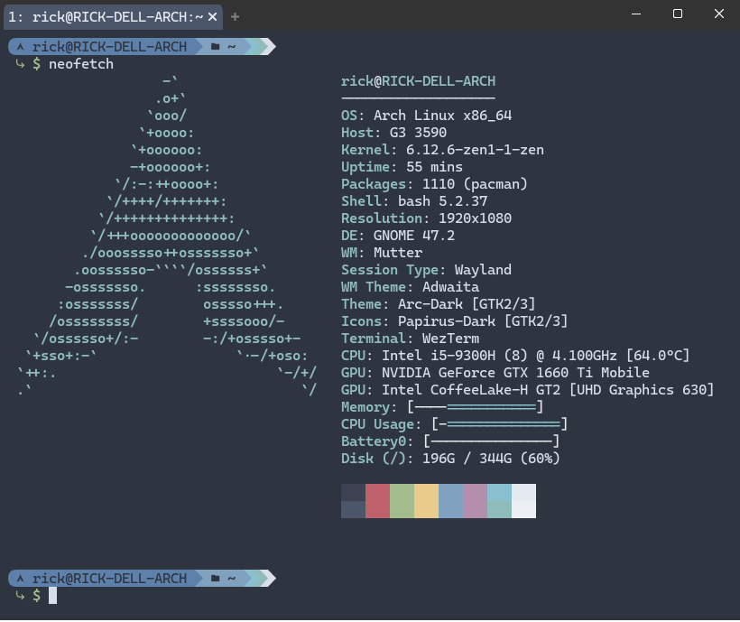

# Nerd fonts on TTYs

Nerd fonts allow to print to screen special characters inside your shell prompts
so that you can obtain useful info directly from your terminal. They also often come
with special character combinations that will modify the printed output with a
"ligature", which I personally love to see.

Unfortunately, it's difficult to enable showing font ligatures on
both terminal emulators and virtual TTYs because of their lack of support.

## Terminal emulators

My terminal emulator of choice is [WezTerm][wezterm] because it specifically
supports font ligatures and it has great customization options.

In my [dotfiles][dotfiles] repo you can find the [WezTerm configuration][wezterm-conf]
that I'm currently using to both enable ligatures and customize the appearance.

## Virtual TTYs

The challenge here is to also enable nerd fonts on virtual TTY, which is not
simple. The default Agetty instances are not able to correctly show special characters,
so we need an alternative.

[KMSCon][kmscon] is one. It's a bit buggy, but I use it so rarely that
I can live with that. One of the bugs is that, upon exiting a shell session,
the TTY does not reset itself and it hungs on a dead screen. The only
way to reset it is to stop the `kmsconvt@ttyX` service, where X is the TTY
number, from another terminal/TTY.

The package I installed is [`kmscon-patched-git`][aur-kmscon-patched-git] because
it's a more recent fork of the original project. I decided to install it on all
TTYs with:

```bash
sudo ln -s '/usr/lib/systemd/system/kmsconvt@.service' '/etc/systemd/system/autovt@.service'
sudo systemctl disable getty@tty1
```

## Nerd Fonts

[Nerd Fonts][nerd-fonts] are usually mono-spaced fonts with special, graphic
characters included that enable users to create fancy prompts and output legato
characters, such as this screenshot:



While most current terminal emulators support Nerd Fonts characters, almost none
of them are able to display the ligatures. WezTerm is an awesome, highly configurable
terminal emulator that can display font ligatures.

The font I use is [Cascadia Code][cascadia-code] by Microsoft,
[installed with pacman][cascadia-pacman] to be displayed also in KMSCon.

<!-- Links -->
[wezterm]: https://wezfurlong.org/wezterm/index.html
[dotfiles]: https://github.com/speziato/dotfiles
[wezterm-conf]: https://github.com/speziato/dotfiles/blob/main/.wezterm.lua
[kmscon]: https://github.com/dvdhrm/kmscon
[aur-kmscon-patched-git]: https://aur.archlinux.org/packages/kmscon-patched-git/
[nerd-fonts]: https://www.nerdfonts.com/
[cascadia-code]: https://github.com/microsoft/cascadia-code
[cascadia-pacman]: https://archlinux.org/packages/extra/any/ttf-cascadia-code/
